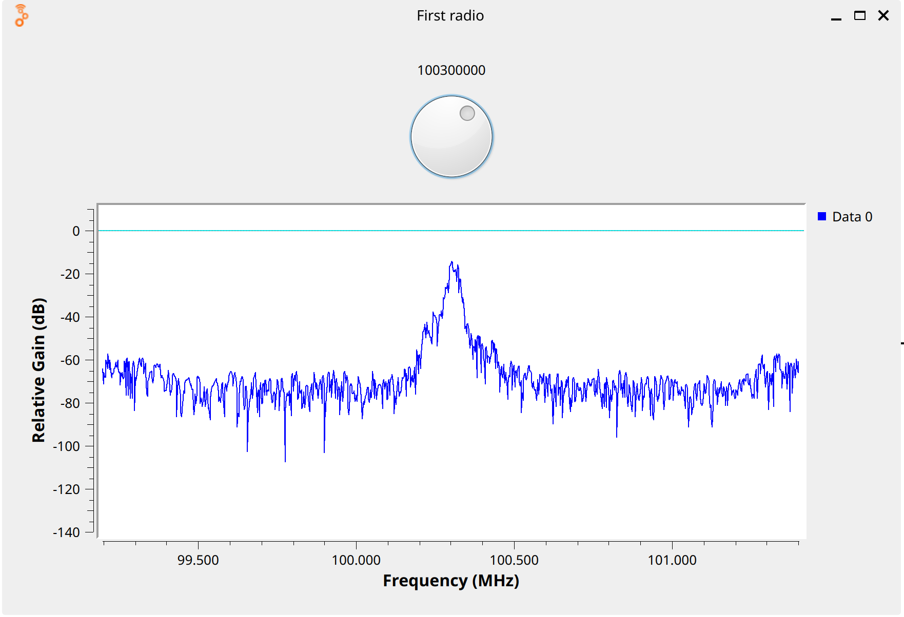

# 📻 SDR Experiment: FM Radio Receiver using RTL-SDR

## 🖼️ Flow Diagram


## 🎛️ Variable Controls
- **freq:** Frequency dial control (88-108 MHz range, default: 100.3 MHz) - Controls the center frequency for FM radio reception
- **samp_rate:** Fixed sample rate at 2,205,000 samples/second

## 🧩 Block Breakdown

### 📡 **RTL-SDR Source** (`soapy_rtlsdr_source_0`)
- **Purpose:** Captures RF signals from RTL-SDR dongle
- **Center Frequency:** Controlled by `freq` variable (88-108 MHz FM band)
- **Sample Rate:** `samp_rate` (2.205 MS/s)
- **Gain:** Fixed at 30 dB
- **Output Type:** Complex float (fc32)

### 🔽 **Low Pass Filter** (`low_pass_filter_0`)
- **Purpose:** Filters and decimates the signal to isolate FM station
- **Cutoff Frequency:** 100 kHz
- **Decimation:** 10 (reduces sample rate from 2.205 MS/s to 220.5 kS/s)
- **Filter Type:** FIR filter with Hamming window
- **Transition Width:** 50 kHz

### 📻 **Wide FM Receiver** (`analog_wfm_rcv_0`)
- **Purpose:** Demodulates the FM signal to extract audio
- **Quadrature Rate:** 220.5 kS/s (matches filter output)
- **Audio Decimation:** 5 (produces 44.1 kS/s audio output)
- **Output:** Mono audio signal

### 🔊 **Audio Sink** (`audio_sink_0`)
- **Purpose:** Plays demodulated audio through speakers/headphones
- **Sample Rate:** 44.1 kHz (standard audio rate)
- **Channels:** Mono (1 input)

### 📊 **Frequency Spectrum Display** (`qtgui_freq_sink_x_0`)
- **Purpose:** Real-time visualization of RF spectrum
- **Center Frequency:** Follows `freq` variable
- **Bandwidth:** `samp_rate` (2.205 MHz)
- **FFT Size:** 1024 points
- **Update Rate:** 0.1 seconds

## 🔗 Signal Flow Connections
```
RTL-SDR Source ──┬──> Low Pass Filter ──> FM Demodulator ──> Audio Sink
                 │
                 └──> Frequency Display
```

## ⚙️ Key Parameters
- **FM Band Coverage:** 88-108 MHz (adjustable via GUI dial)
- **Signal Processing Chain:** RF → Filtering → FM Demod → Audio
- **Real-time Spectrum Analysis:** Parallel path for signal visualization
- **Audio Output:** Standard 44.1 kHz for computer audio systems

## 🎯 Experiment Purpose
This GNU Radio flowgraph creates a complete FM radio receiver using an RTL-SDR dongle. It demonstrates the fundamental SDR processing chain: signal acquisition, filtering, demodulation, and audio output, with real-time spectrum visualization for educational and practical FM radio reception.