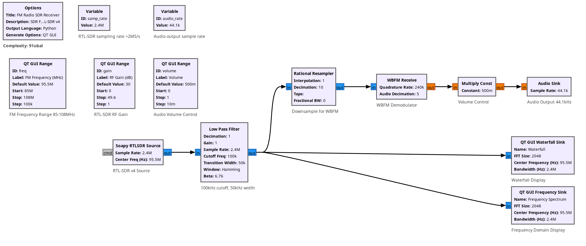
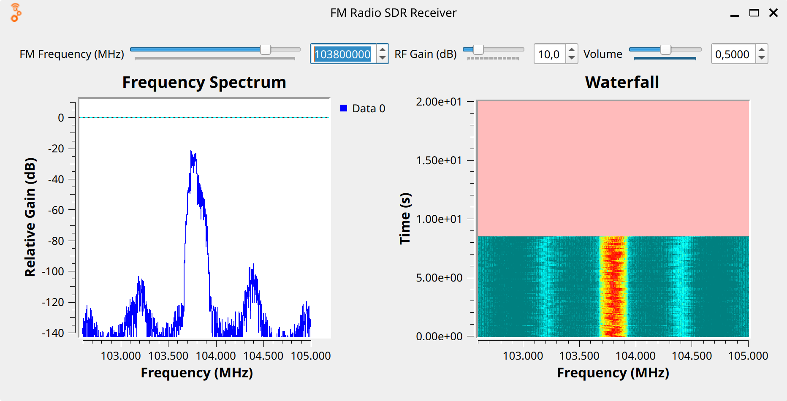

# 📻 SDR FM Radio Receiver with RTL-SDR v4 and Real-time Visualization

## 🖼️ Flow Diagram & User Interface



## 🎛️ Variable Controls
- **freq:** FM Frequency Range (85-108 MHz, default: 95.5 MHz) - Interactive slider to tune FM radio stations
- **gain:** RF Gain (0-49.6 dB, default: 30 dB) - Controls RTL-SDR amplification for signal strength
- **volume:** Audio Volume (0-1, default: 0.5) - Controls output audio level
- **samp_rate:** Fixed sample rate at 2,400,000 samples/second - RTL-SDR sampling frequency
- **audio_rate:** Fixed audio output rate at 44,100 Hz - Standard audio playback rate

## 🧩 Block Breakdown

### 📡 **RTL-SDR Source** (`soapy_rtlsdr_source_0`)
- **Purpose:** Captures RF signals from RTL-SDR v4 dongle
- **Center Frequency:** Controlled by `freq` variable (85-108 MHz FM band)
- **Sample Rate:** `samp_rate` (2.4 MS/s)
- **Gain:** Variable `gain` (0-49.6 dB)
- **Output Type:** Complex float (fc32)

### 🔽 **Low Pass Filter** (`low_pass_filter_0`)
- **Purpose:** Anti-aliasing filter to prevent frequency folding
- **Cutoff Frequency:** 100 kHz
- **Transition Width:** 50 kHz
- **Filter Type:** FIR filter with Hamming window
- **Beta:** 6.76

### 📉 **Rational Resampler** (`rational_resampler_xxx_0`)
- **Purpose:** Decimates signal for WBFM demodulator
- **Decimation:** 10 (reduces sample rate from 2.4 MS/s to 240 kS/s)
- **Interpolation:** 1
- **Type:** Complex-to-complex

### 📻 **Wide FM Receiver** (`analog_wfm_rcv_0`)
- **Purpose:** Demodulates wideband FM signal to extract audio
- **Quadrature Rate:** 240 kS/s (matches resampler output)
- **Audio Decimation:** 5 (produces 48 kS/s → 44.1 kS/s audio)
- **Output:** Mono audio signal

### 🔊 **Volume Control** (`blocks_multiply_const_vxx_0`)
- **Purpose:** Adjustable audio volume control
- **Multiplier:** `volume` variable (0-1)
- **Type:** Float multiplier

### 🎵 **Audio Sink** (`audio_sink_0`)
- **Purpose:** Plays demodulated audio through speakers/headphones
- **Sample Rate:** `audio_rate` (44.1 kHz)
- **Channels:** Mono (1 input)

### 📊 **Frequency Spectrum Display** (`qtgui_freq_sink_x_0`)
- **Purpose:** Real-time RF spectrum visualization
- **Center Frequency:** Follows `freq` variable
- **Bandwidth:** `samp_rate` (2.4 MHz)
- **FFT Size:** 2048 points
- **Update Rate:** 0.1 seconds
- **Y-axis Range:** -140 to +10 dB

### 🌊 **Waterfall Display** (`qtgui_waterfall_sink_x_0`)
- **Purpose:** Time-frequency waterfall visualization
- **Center Frequency:** Follows `freq` variable
- **Bandwidth:** `samp_rate` (2.4 MHz)
- **FFT Size:** 2048 points
- **Update Rate:** 0.1 seconds
- **Intensity Range:** -140 to +10 dB

## 🔗 Signal Flow Connections
```
RTL-SDR Source ──> Low Pass Filter ──┬──> Rational Resampler ──> WBFM Demodulator ──> Volume Control ──> Audio Sink
                                      │
                                      ├──> Frequency Spectrum Display
                                      │
                                      └──> Waterfall Display
```

## ⚙️ Key Parameters
- **FM Band Coverage:** 85-108 MHz (full commercial FM band)
- **Real-time Controls:** Frequency tuning, RF gain, and volume adjustment
- **Signal Processing Chain:** RF → Filtering → Decimation → FM Demod → Audio
- **Dual Visualization:** Frequency spectrum and waterfall displays
- **Audio Output:** Standard 44.1 kHz for computer audio systems
- **RTL-SDR Compatibility:** Optimized for RTL-SDR v4 dongles

## 🎯 Experiment Purpose
This GNU Radio flowgraph creates a more feature-rich FM radio receiver using an RTL-SDR v4 dongle with real-time visualization capabilities. It demonstrates advanced SDR concepts including proper anti-aliasing filtering, sample rate conversion, wideband FM demodulation, and dual-domain signal analysis. The interactive GUI provides intuitive controls for frequency tuning, gain adjustment, and volume control, making it ideal for both educational purposes and practical FM radio reception with comprehensive signal monitoring.