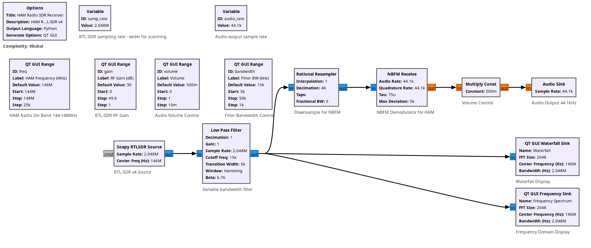
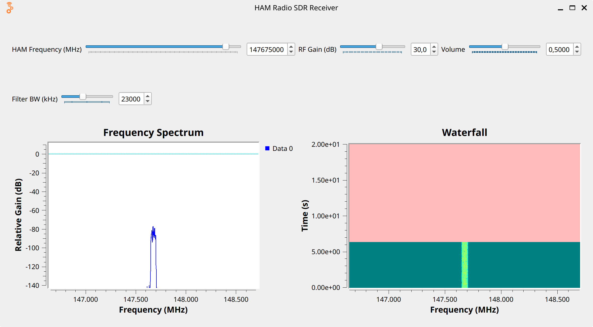

# 📻 SDR HAM Radio Receiver for 2m Band (144-148 MHz) using RTL-SDR v4

## 🖼️ Flow Diagram & User Interface



## 🎛️ Variable Controls
- **freq:** HAM Frequency Range (144-148 MHz, default: 146 MHz) - Interactive slider to tune amateur radio 2-meter band stations
- **gain:** RF Gain (0-49.6 dB, default: 30 dB) - Controls RTL-SDR amplification for signal strength
- **volume:** Audio Volume (0-1, default: 0.5) - Controls output audio level
- **bandwidth:** Filter Bandwidth (5-50 kHz, default: 15 kHz) - Adjustable filter width for signal selectivity
- **samp_rate:** Fixed sample rate at 2,048,000 samples/second - RTL-SDR sampling frequency optimized for scanning
- **audio_rate:** Fixed audio output rate at 44,100 Hz - Standard audio playback rate

## 🧩 Block Breakdown

### 📡 **RTL-SDR Source** (`soapy_rtlsdr_source_0`)
- **Purpose:** Captures RF signals from RTL-SDR v4 dongle
- **Center Frequency:** Controlled by `freq` variable (144-148 MHz HAM 2m band)
- **Sample Rate:** `samp_rate` (2.048 MS/s)
- **Gain:** Variable `gain` (0-49.6 dB)
- **Output Type:** Complex float (fc32)

### 🔽 **Low Pass Filter** (`low_pass_filter_0`)
- **Purpose:** Variable bandwidth filtering for signal selectivity
- **Cutoff Frequency:** `bandwidth` (5-50 kHz, adjustable)
- **Transition Width:** `bandwidth/3` (automatic scaling)
- **Filter Type:** FIR filter with Hamming window
- **Beta:** 6.76

### 📉 **Rational Resampler** (`rational_resampler_xxx_0`)
- **Purpose:** Decimates signal for NBFM demodulator
- **Decimation:** 46 (reduces sample rate from 2.048 MS/s to ~44.5 kS/s)
- **Interpolation:** 1
- **Type:** Complex-to-complex

### 📻 **Narrow Band FM Receiver** (`analog_nbfm_rx_0`)
- **Purpose:** Demodulates narrowband FM signal for HAM radio communications
- **Quadrature Rate:** 44.1 kS/s (matches resampler output)
- **Audio Rate:** `audio_rate` (44.1 kHz)
- **Max Deviation:** 5 kHz (typical for NBFM)
- **De-emphasis:** 75 μs (standard for amateur radio)
- **Output:** Mono audio signal

### 🔊 **Volume Control** (`blocks_multiply_const_vxx_0`)
- **Purpose:** Adjustable audio volume control
- **Multiplier:** `volume` variable (0-1)
- **Type:** Float multiplier

### 🎵 **Audio Sink** (`audio_sink_0`)
- **Purpose:** Plays demodulated audio through speakers/headphones
- **Sample Rate:** `audio_rate` (44.1 kHz)
- **Channels:** Mono (1 input)

### 📊 **Frequency Spectrum Display** (`qtgui_freq_sink_x_0`)
- **Purpose:** Real-time RF spectrum visualization
- **Center Frequency:** Follows `freq` variable
- **Bandwidth:** `samp_rate` (2.048 MHz)
- **FFT Size:** 2048 points
- **Update Rate:** 0.1 seconds
- **Y-axis Range:** -140 to +10 dB

### 🌊 **Waterfall Display** (`qtgui_waterfall_sink_x_0`)
- **Purpose:** Time-frequency waterfall visualization
- **Center Frequency:** Follows `freq` variable
- **Bandwidth:** `samp_rate` (2.048 MHz)
- **FFT Size:** 2048 points
- **Update Rate:** 0.1 seconds
- **Intensity Range:** -140 to +10 dB

## 🔗 Signal Flow Connections
```
RTL-SDR Source ──> Low Pass Filter ──┬──> Rational Resampler ──> NBFM Demodulator ──> Volume Control ──> Audio Sink
                                      │
                                      ├──> Frequency Spectrum Display
                                      │
                                      └──> Waterfall Display
```

## ⚙️ Key Parameters
- **HAM Band Coverage:** 144-148 MHz (2-meter amateur radio band)
- **Real-time Controls:** Frequency tuning, RF gain, volume, and filter bandwidth adjustment
- **Signal Processing Chain:** RF → Variable Filtering → Decimation → NBFM Demod → Audio
- **Dual Visualization:** Frequency spectrum and waterfall displays for signal monitoring
- **Audio Output:** Standard 44.1 kHz for computer audio systems
- **RTL-SDR Compatibility:** Optimized for RTL-SDR v4 dongles with HAM radio frequencies

## 🎯 Experiment Purpose
This GNU Radio flowgraph creates a specialized HAM radio receiver for the 2-meter amateur radio band (144-148 MHz) using an RTL-SDR v4 dongle. It's an adaptation of the standard FM radio receiver, modified specifically for amateur radio communications with narrowband FM demodulation, variable bandwidth filtering, and optimized sampling rates for the VHF amateur bands. The configuration demonstrates advanced SDR concepts including proper signal conditioning for HAM radio reception, NBFM demodulation with appropriate de-emphasis, and comprehensive signal analysis tools for monitoring amateur radio activity. The interactive GUI provides essential controls for frequency scanning, signal strength optimization, and audio level adjustment, making it ideal for amateur radio enthusiasts, emergency communications monitoring, and educational exploration of VHF radio communications.

## 🔗 Related Projects
This configuration is based on the [fm-radio](../fm-radio/) receiver but adapted specifically for HAM radio frequencies and narrowband FM operation, demonstrating the versatility of SDR technology across different radio services.